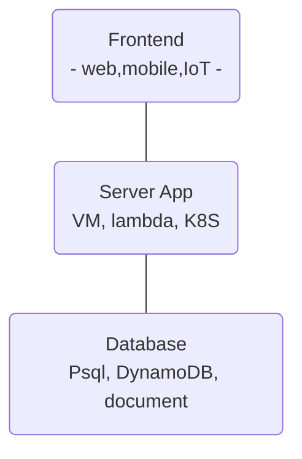

# Przkłady tematów

Lista ta będzie rozbudowywana. Tematy projektów nowatorskich nie muszą koniecznie być związane z chmurą obliczeniową, mobilnymi aplikacjami...

Można zacząć od podstawowej architektury dla aplikacji web (dla uproszczenia pominąłem cache, kolejki, ...):

## Rozwijanie aplikacji w chmurze

Można zbudować wszystkie 3 warstwy w pracy alibo skupić się na jednym z aspektów:

1. Można skupić się na samej aplikacji (mobilna, REST, web )

2. Budujemy aplikację i porównujemy deployowanie aplikacji korzystając z PaaS, Serverless, CaaS (e.g., Kubernetes). Cel pracy będzie definiował jak będziemy robić porównanie,

3. Budujemy aplikację REST i piszemy pracę poświęconą jej monitoringowi - logi, metryki, oraz trace z użyciem stacka Prometheus czy Grafany,

4. Aplikacja prosta, ale budujemy continuous deployment process oparty o, np., githuba lub ArgoCD (jeśli celem miałby być Kubernetes),

5. Można też pójść w kierunku infrastructure-as-a-Code, czyli najlepsze praktyki dla Terragrunta, Terraforma wraz z implementacją dla aplikacji 3 wartwowej.

6. ...

### Materiały

- Trochę o infra-as-a-code - https://github.com/wojciech11/se_cloud_app_administration_and_development
- Materialy o CI/CD - https://github.com/wojciech11/se_continuous_delivery_and_deployment
- Dobre praktyki dla budowy aplikacji na K8S - https://github.com/wojciech12/workshop_kubernetes_and_cloudnative/blob/master/04_app_development/slides/index.pdf

## Budowa aplikacje od IoT, serwer, po mobilne

1. Zbudowanie aplikacji dla X w Fluterze lub Kotlinie

2. Praca z wykorzystaniem Cloudflare workers

3. TBA

## Integracje, DevOps i plaform engineering

1. Wykorzystanie Backstage-a do katalogu wewnętrznych serwisów

2. Zbudowanie pluginu do X

## Inne

1. Projekt sieci dostępowej do realizacji usług multimedialnych dla osiedla ... w mieście ...
2. Projekt zabezpieczeń antywłamaniowych dla ... szkoły/firmy
3. Projekt sieci miejskiej i serwerowni dla oddziałów banku/firmy/przychodni/uczelni
4. Projekt sieci multimedialnej z gwarantowaną jakością usług (QoS).
5. Projekt monitoringu dla obiektu/osiedla/miasta
6. Projekt bezpiecznej sieci bezprzewodowej dla miasta/gminy
7. Analiza możliwości rozwoju usług multimedialnych w sieciach IP.
8. Projekt sieci sensorycznej ciała ludzkiego w monitoringu zdrowia pacjenta
9. Analiza możliwości wybranych chmur obliczeniowych
10. Koncepcja symulatora do realizacji i analizy usług multimedialnych
11. Koncepcja sieci teleinformatycznej na potrzeby przedsiębiorstwa produkcyjnego
12. Projekt sieci teleinformatycznej do obsługi telefonii internetowej dla osiedla ...
13. Projekt sieci WLAN dla miasta...
14. Analiza porównawcza protokołów routingu dynamicznego
15. Projekt systemu sterowania oświetleniem/czymkolwiek przy użyciu platformy Arduino
16. Analiza metod testowania oprogramowania w projektach informatycznych.
17. Projekt aplikacji do zarządzania pracą laboratorium medycznego
18. Projekt aplikacji do obsługi e-przychodni.
19. Projekt sieci VoIP na potrzeby małego przedsiębiorstwa z oddziałami w miastach X i Y
20. Projekt inteligentnej sieci sterowania ruchem w ... nazwa miasta
21. Projekt i implementacja aplikacji internetowej zarządzającej wypożyczalnią samochodów
22. Projekt systemu inteligentnego alarmu
23. Projekt i wykonanie urządzenia do bezprzewodowego pomiaru temperatury.
24. Projekt systemu nauczania zdalnego w …
25. Projekt wykorzystania narzędzi do pracy zdalnej z klientem/pracownikiem w przychodni, przedsiębiorstwie
26. System wspierania współpracy zdalnej w rozproszonym przedsiębiorstwie
27. Projekt przeniesienia do Internetu usług przedsiębiorstwa działającego do tej pory w klasycznym modelu (np. restauracja, cukiernia).
28. Aplikacje wspierające pracę … przedsiębiorstw, urzędów, szkół, przedszkoli, bibliotek…
29. Projekt organizacji np. e-spotkań, e-konferencji przy wykorzystaniu narzędzi pracy zdalnej
30. Usprawnienia systemów informacyjnych wspomagających zarządzanie przedsiębiorstwem
31. Zastosowanie systemów informacyjnych do wspomagania różnych obszarów przedsiębiorstwa
32. Projekt wykorzystania social mediów w działalności wybranego przedsiębiorstwa.
33. Rozwiązania informatyczne wspierające proces współdzielenia dóbr i usług (na wzór Uber, BlaBlaCar, Airbnb, itp.)
34. Projektowanie systemów rozrywkowych (grywalność)
35. Outsourcing sieciowy usług informatycznych
36. Projekt inteligentnego... np. domu
37. Zastosowania systemów i technologii wspomagających pracę grupową w organizacji
38. Projekt wdrożenia systemy informatycznego klasy ERP w przedsiębiorstwie XYZ
39. Projekt wdrożenia dodatkowej funkcjonalności w systemie informatycznym klasy ERP
40. Projekt automatyzacji wybranych funkcjonalności biznesowych w wybranym systemie informatycznym klasy ERP