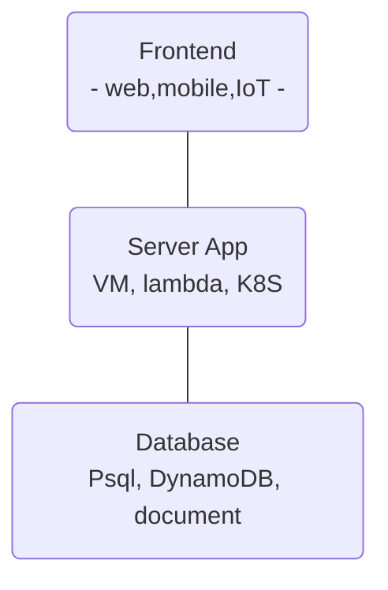

# Przkłady tematów

Lista ta będzie rozbudowywana. Tematy projektów nowatorskich nie muszą koniecznie być związane z chmurą obliczeniową. 

## Rozwiajanie aplikacji w chmurze

Można zacząć od podstawowej architektury dla aplikacji web (dla uproszczenia pominąłem cache, kolejki, ...):

Można zbudować wszystkie 3 warstwy w pracy i rozbudować wokół jednego aspektu:

1. Można skupić się na samej aplikacji (mobilna, REST, web )

2. Budujemy aplikację i porównujemy deployowanie aplikacji korzystając z PaaS, Serverless, CaaS (e.g., Kubernetes). Cel pracy będzie definiował jak będziemy robić porównanie,

3. Budujemy aplikację REST i piszemy pracę poświęconą jej monitoringowi - logi, metryki, oraz trace z użyciem stacka Prometheus czy Grafany,

4. Aplikacja prosta, ale budujemy continuous deployment process oparty o, np., githuba lub ArgoCD (jeśli celem miałby być Kubernetes),

5. Można też pójść w kierunku infrastructure-as-a-Code, czyli najlepsze praktyki dla Terragrunta, Terraforma wraz z implementacją dla aplikacji 3 wartwowej.

6. ...

### Materiały

- Trochę o infra-as-a-code - https://github.com/wojciech11/se_cloud_app_administration_and_development
- Materialy o CI/CD - https://github.com/wojciech11/se_continuous_delivery_and_deployment
- Dobre praktyki dla budowy aplikacji na K8S - https://github.com/wojciech12/workshop_kubernetes_and_cloudnative/blob/master/04_app_development/slides/index.pdf

## Budowa aplikacje od IoT, serwer, po mobilne

1. Zbudowanie aplikacji dla X w Fluterze lub Kotlinie

2. Praca z wykorzystaniem Cloudflare workers

3. TBA

## Integracje i plaform / infra engineering

1. Wykorzystanie Backstage-a do katalogu wewnętrznych serwisów

2. Zbudowanie pluginu do X
