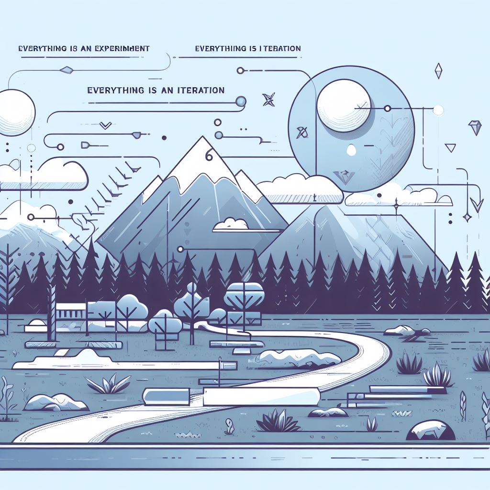

<!-- _class: lead -->
## Innovative Technical Project 2



Semester 2 z 3 (halfway point).

---
<!-- _class: lead -->
## Goal

From the [semester 1](https://github.com/wojciech11/se_techniczny_projekt_nowatorski/blob/master/00_intro/index.pdf):

1. Submit on time,
2. Good grade,
3. Learn something new,
4. Without too much stress.

---
<!-- _class: lead -->
## Communication with the thesis advisor
<br />

Email:

- wojciech.barczynski@wroclaw.merito.pl
- email subject postfix: (Innovative Technical Project 2, [group identifier]), for e.g.:

  `demo recording (Innovative Technical Project 2, L_III_S_INFI_S2_(IAM)) `

---
<!-- _class: lead -->
## Communication with the thesis advisor
<br />

MS Teams:

- Please include in your first message:<br />*Innovative Technical Project 2* and *group identifier*.

---
<!-- _class: lead -->
## Status after the first semester
<br />

The next meeting (**mandatory**):

- Demo,
- Working PoC or MVP,
- **all in git**.

---
<!-- _class: lead -->
## Status after the first semester
<br />

Git repository:

```
|- ...
|- docs/
|   |- related_work/
|   |- data/
|   |- ...
|   \- (surname)_(name)_(student id)_praca.docx # draft (optional)
|
|- code
|
\- README.md
```

---
<!-- _class: lead -->
## Status after the first semester
<br />

`README.md`:

- what problem do you solve/why it is important (why);
- what you will develop (what);
- how exactly, e.g., Django app that... (how).

---
<!-- _class: lead -->
## Goal for the semester 2
<br />

Priorities / recommended effort:

1. Application - end2end and happy paths - 80%;
2. Thesis - ToC, draft with described sections, literature  - 20%.

Working complex App has the highest priority.

---
<!-- _class: lead -->
## Goal for the semester 2

Plan:<br />

[github.com/wojciech11/se_techniczny_projekt_nowatorski](https://github.com/wojciech11/se_techniczny_projekt_nowatorski)

---
<!-- _class: lead -->
## App Development  
<br />

- Tracer-bullet development;

- Deliver, patch, patch;

- Everything is an iteration.

---
<!-- _class: lead -->
## App Development
<br />

Flow:

1. iteration, push to git
2. iteration, push to git
3. iteration...

<!-- Co iteracja, deploy do prod - krótki lead time i wysokie deploy freq (patrz DORA metrics). -->

---
<!-- _class: lead -->
## Support each other
<br />

1. Easier to work in a group;
2. With regular meetings, so you keep working on your app and thesis;
3. Your and your peer use the same tech, you can learn together new technology or methodology.

---
<!-- _class: lead -->
## Semester 2: Repository
<br>

- Working app;
- why,what, and how in `README.md`;
- `README.md` with linked demo.
- Maybe even CD/CI (linter)!

---
<!-- _class: lead -->
## Semester 2: README.md

```markdown
# Thesis topic

* Description (why,what, i how)*

*Link to a demo or slides*

## Development

*how to start the app locally*

*how to install it on cloud (optional)*

## Additional resources

*links do docs relevant for the app and the thesis*
```

---
<!-- _class: lead -->
## Thesis topic

Consistent story based on your thesis strengths:

1. Thesis topic showing what you focus on in your thesis;
2. The introduction (why, what, how) should make it clear to the thesis advisor what problem you solve.
3. Chapters names.

---
<!-- _class: lead -->
## Thesis topic

Przykład:

- nie: budowa MMORG... (zakładając, że poszliśmy bardzo ambitlnie i wielkość projektu nas przytłacza);
- tak: generewanie asetów graficznych na przykładzie klona HoMM3.

Pod koniec semestry 2, trzeba będzie podjąć decyzję.

---
<!-- _class: lead -->
## Writing your Thesis

Recommendations:

- wyłączamy podkreślanie gramatyki itp.
- Przelewamy na "papier" swoje myśli,
- koniec paragrafu? Teraz redagujemy

I recommend to read - ([the Writing with Power book](https://www.amazon.com/Writing-Power-Techniques-Mastering-Process/dp/0195120183)).

---
<!-- _class: lead -->
## Your thesis

In the github repository (docx, latex...):

```
|- ...
|- docs/
|   |- related_work/
|   |- data/
|   |- ...
|   \- (nazw)_(imie)_(numer albumu)_praca.docx
|
|- kod i implementacja
|
\- README.md
```

---
<!-- _class: lead -->
## Optional: docs/plan2.md

You can go with, e.g., Google Spreadsheet, Trello, or Clickup.

```
## Plan 

Date                    | Task            | Notes    |
------------------------|-----------------|----------|
2023-03-11              |                 |          |
2023-05-01 - 2023-05-18 |                 |          |

## Tracking

Date (every 2 weeks) | ETA                  | Notes          |
---------------------|----------------------|----------------|
2023-02-01           | march v1<br/>June v2 | So far I did X |
2023-02-15           | march v1             |                |
...                  | ...                  |                |
```

---
<!-- _class: lead -->
## Questions?
<br />

---
<!-- _class: lead -->
## Thank you
<br />

---
<!-- _class: lead -->
## Misc
<br />

Facilitate growth:

- [Ed Batista - the art of self coaching](https://www.edbatista.com/the-art-of-self-coaching-public-course.html),
- [yes, and...,](https://en.wikipedia.org/wiki/Yes,_and...)
- masterclass,
- or [other initiatives](https://eonyc.org/wp-content/uploads/EOResources/ModeratorResources/MyEOForumModeratorGuidebook.pdf).
