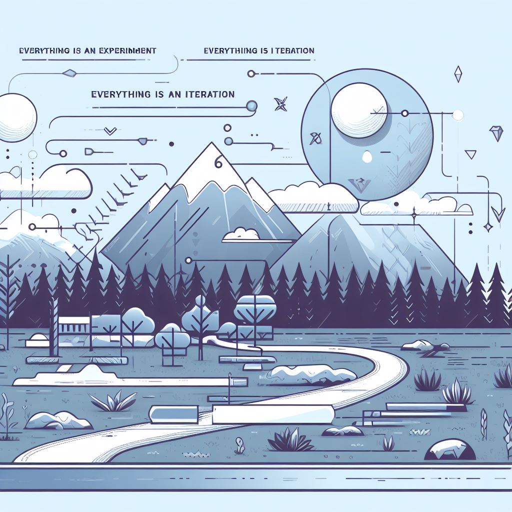

<!-- _class: lead -->
## Techniczny Projekt Nowatorski



Semestr 2 z 3 (półmetek).

---
<!-- _class: lead -->
## Cel

Według prorytetu [[1](https://github.com/wojciech11/se_techniczny_projekt_nowatorski/blob/master/00_wstep/index.pdf)]:

1. Oddanie na czas,
2. Dobra ocena,
3. Nauczenie się czegoś nowego,
4. Bez tracenia nerwów.

---
<!-- _class: lead -->
## Status po pierwszym semestrze
<br />

Na następnym spotkaniu sprawdzimy:

- Demo: PoC lub MVP działające

- Pokazanie: pracy pisemnej

---
<!-- _class: lead -->
## Status po pierwszym semestrze
<br />

Repozytorium:

```
|- ...
|- docs/
|   |- related_work/
|   |- data/
|   |- ...
|   \- (nazw)_(imie)_(numer albumu)_praca.docx
|
|- kod i implementacja
|
\- README.md
```

---
<!-- _class: lead -->
## Cel dla semestru 2
<br />

Prorytety / sugerowane przeznaczenie czasu:

1. Aplikacja - end2end w happy path - 80%;
2. Część pisemna - draft z opisami sekcji - 20%.

Budowa aplikacji ma najwyższy priorytet.

---
<!-- _class: lead -->
## Cel dla semestru 2

Plan na semestr:<br />

[github.com/wojciech11/se_techniczny_projekt_nowatorski](https://github.com/wojciech11/se_techniczny_projekt_nowatorski)

---
<!-- _class: lead -->
## Aplikacja
<br />

- Tracer-bullet development;

- Deliver, patch, patch.

---
<!-- _class: lead -->
## Aplikacja
<br />

Flow:

1. iteracja, push do gita
2. iteracje, push do gita
3. iteracje...

Co iteracja, deploy do prod - krótki lead time i wysokie deploy freq (patrz DORA metrics).

---
<!-- _class: lead -->
## Praca wspólna
<br />

- parowanie się,
- umawianie się na wspólną sesję, aby pracować nad pracą inż.

---
<!-- _class: lead -->
## Repozytorium
<br>
Kod:

- Działający kod
- klarowny `README.md`
- `README.md` z podpiętym demem
- Duży plus za CD/CI (linter)!

---
<!-- _class: lead -->
## README.md

```markdown
# Tytuł pracy

*Opis tematu (why,what, i how)*

*Link do dema / prezentacji*

## Development

*jak uruchomić lokalnie*

*jak zainstalować na chmurze*

## Additional resources

*linki do dokumentacji istotnej dla aplikacji, projektu, co kolwiek co było nam pomocne*
```

---
<!-- _class: lead -->
## Temat części pisemnej

Spójna historia, oparta na mocnych stronach waszej pracy:

1. Temat podkreślający focus waszej pracy;
2. Wprowadzenie: why, what, how nakierowuje recenzenta, co jest problemem/celem aplikacji;
3. Nazwy tytułów rozdziałów.

---
<!-- _class: lead -->
## Temat części pisemnej

Przykład:

- nie: budowa MMORG... (zakładając, że poszliśmy bardzo ambitlnie i wielkość projektu nas przytłacza);
- tak: generewanie asetów graficznych na przykładzie klona HoMM3.

Pod koniec semestry 2, trzeba będzie podjąć decyzję.

---
<!-- _class: lead -->
## Część Pisemna

Rekomendacja:

- wyłączamy podkreślanie gramatyki itp.
- Przelewamy na "papier" swoje myśli,
- koniec paragrafu? Teraz redagujemy

Warto przeczytać - ([writing with power](https://www.amazon.com/Writing-Power-Techniques-Mastering-Process/dp/0195120183)).

---
<!-- _class: lead -->
## Część Pisemna

W repozytorium githuba (docx, latex...):

```
|- ...
|- docs/
|   |- related_work/
|   |- data/
|   |- ...
|   \- (nazw)_(imie)_(numer albumu)_praca.docx
|
|- kod i implementacja
|
\- README.md
```

---
<!-- _class: lead -->
## Po dzisiejszym spotkaniu:

Przeczytać/przypomnieć sobie: [wymagania formalne](https://github.com/wojciech11/se_techniczny_projekt_nowatorski/tree/master/01_wymagania_formalne).

---
<!-- _class: lead -->
## Po dzisiejeszym spotkaniu
<br />

Do repozytorium:

- plan na semestr (`docs/plan2.md`), z wyszczególnionymi punktami
- kolejna iteracja pracy nad kodem

---
<!-- _class: lead -->
## docs/plan2.md

Alternatywa, e.g., Google Spreadsheet:

```
# Plan - semestr 2
## Plan 

Data                    | Zadanie         | Notatka    |
------------------------|-----------------|------------|
2023-03-11              |                 |  Zrobimy X |
2023-05-01 - 2023-05-18 |                 |  Zrobimy Y |

## Tracking

Data (co 2 tyg) | ETA                  | Notatka                      |
----------------|----------------------|------------------------------|
2023-02-01      | march v1<br/>June v2 | Zrobilismy X                 |
2023-02-15      | march v1             | Review design doc z klientem |
2023-03-01      | 1/2 half Aptil v1    |                              |
...             | ...                  |                              |
```

---
<!-- _class: lead -->
## docs/plan2.md

- czym dalej w przyszłość tym większa jednostka miary,
- the planning activity is everything,
- w projekcie byśmy co 2 tygodnie sprawdzali, gdzie jesteśmy i czy musimy zmienić plan.

---
<!-- _class: lead -->
## Następne spotkanie

[Checkpoint](https://github.com/wojciech11/se_techniczny_projekt_nowatorski/tree/master/12_checkpoint):

- demo, kod, gdzie jesteśmy
- część pisemna

**Wszystko w repozytorium**.

---
<!-- _class: lead -->
## Dziękuję za uwagę
<br />

---
<!-- _class: lead -->
## Backup
<br />

---
<!-- _class: lead -->
## Inne poradniki

- [Poradnik](https://www.ii.pwr.edu.pl/~michalski/media/poradnik.pdf).

---
<!-- _class: lead -->
## Misc
<br />

Facilitate growth:

- [Ed Batista - the art of self coaching](https://www.edbatista.com/the-art-of-self-coaching-public-course.html),
- [yes, and...,](https://en.wikipedia.org/wiki/Yes,_and...)
- masterclass,
- or [other initiatives](https://eonyc.org/wp-content/uploads/EOResources/ModeratorResources/MyEOForumModeratorGuidebook.pdf).
